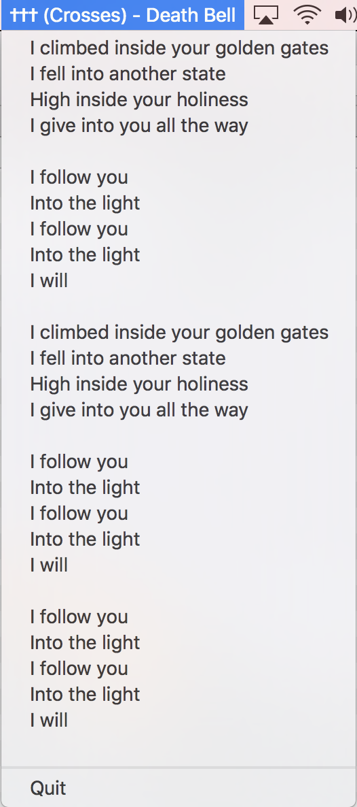

# pyet

A simple MacOS menubar application for your spotify lyrics needs.

Developed and tested on `python3.6`.

## Sample
Idle

Active


## Dependencies
```bash
bs4
pyobjc
```

## Install

```bash
git clone https://github.com/danthelion/pyet 
cd pyet
virtualenv pyet_venv
source pyet_venv/bin/activate
python setup.py install
```

## Run
```bash
pyet.py &
```