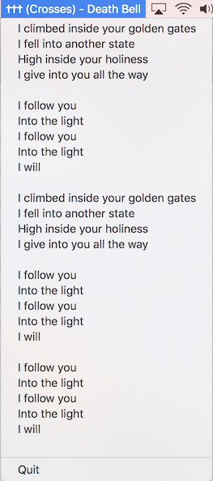

# pyet

A very simple MacOS menubar application that displays the Artist and Track name of the song you are currently listening to on Spotify.
On click it should display the lyrics of the songs (if available via azlyrics).

Developed and tested on `python3.6`.

## Sample
* Idle


* Active



## Python Dependencies
```bash
bs4
pyobjc
```

## Install

```bash
git clone https://github.com/danthelion/pyet 
cd pyet
virtualenv pyet_venv
source pyet_venv/bin/activate
python setup.py install
```

## Run
```bash
pyet.py &
```